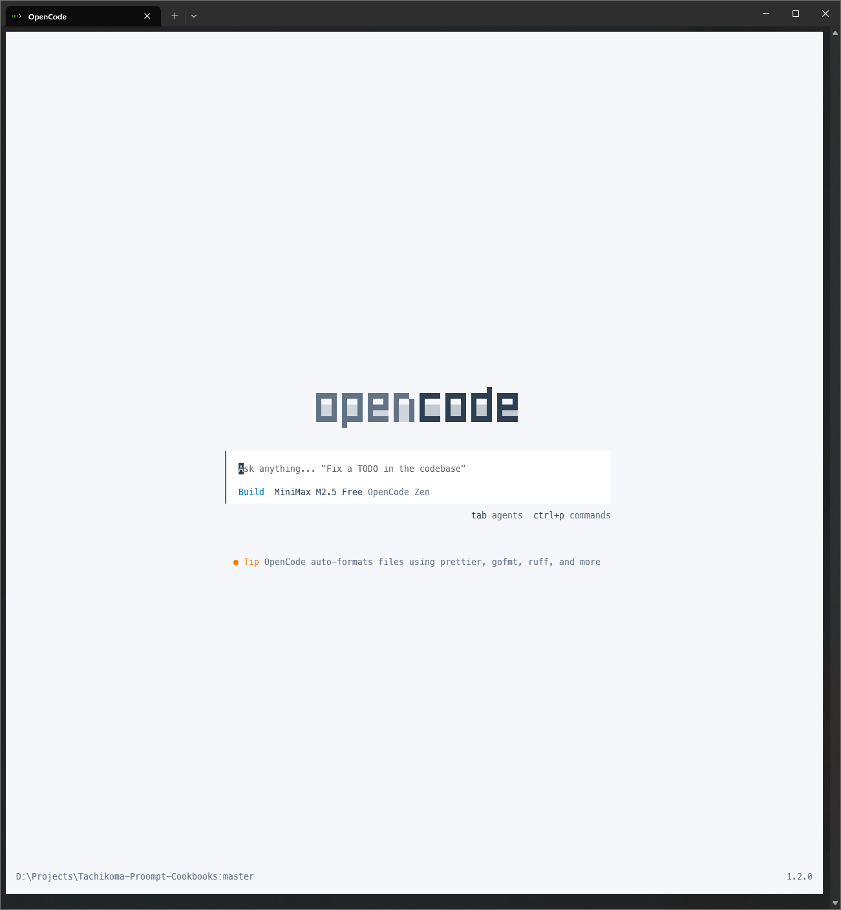
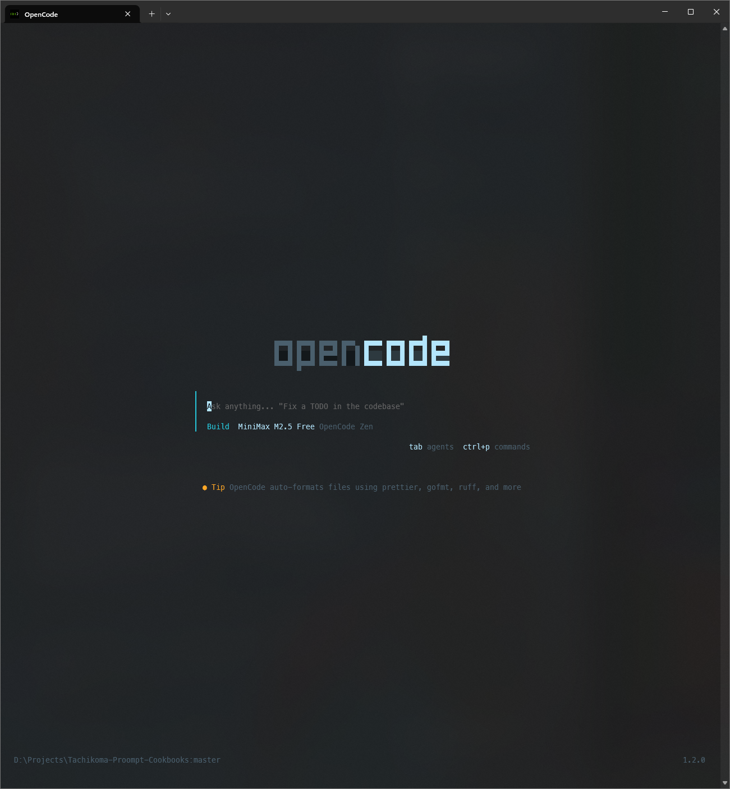

<p align="center">
    
</p>

# Tachikoma

Routes requests to the right specialist. Classifies intent, loads relevant context, executes.

Named after the curious AI tanks from _Ghost in the Shell_.

---

## What It Does

```
User: "Fix the auth bug"
    ↓
1. Classify: debug intent (95% confidence)
2. Load: coding-standards + commenting-rules
3. Route: code-agent skill
4. Execute: Bug fixed
5. Reflect: Flag related issues, suggest improvements
```

**Structure at the start, freedom at the end.**

Phases 1-4 are mandatory. Phase 5 is free — the agent can question its approach, flag concerns, or suggest improvements.

---

## Core Concepts

| Concept | What It Means |
|---------|---------------|
| **Orchestrator** | Primary agent coordinates all activity |
| **Intent Routing** | Classifies requests, routes to appropriate skills |
| **Context Modules** | Project-specific rules load based on task type |
| **Skills** | Specialized capabilities for specific tasks |
| **Subagents** | Workers for large-context or parallel tasks |

---

## Quick Install

```bash
# 1. Clone the repo
git clone https://github.com/Nirvaxstiel/Tachikoma-Proompt-Cookbooks.git
cd Tachikoma-Proompt-Cookbooks

# 2. Install Bun (one-time if not already installed)
# Linux/macOS:
curl -fsSL https://bun.sh/install | bash

# Windows:
winget install Oven.Shell.Bun

# 3. Install tachikoma command to your system
bash install
```

> **Requirements**: Bun (~150MB) - https://bun.sh

Full guide: [docs/getting-started.md](docs/getting-started.md)

---

## Use Tachikoma in Your Project

```bash
# 1. cd to your project repository
cd /path/to/your/project

# 2. Run tachikoma to install the agent
tachikoma

# Choose:
# 1) Global - available in all projects
# 2) Local  - this project only
```

**Global Installation Paths:**
- All platforms: `~/.config/opencode`
  - Windows: `C:\Users\username\.config\opencode`
  - macOS: `/Users/username/.config/opencode`
  - Linux: `/home/username/.config/opencode`

---

## Documentation

| What | Where |
|------|-------|
| Overview | [docs/concepts/overview.md](docs/concepts/overview.md) |
| Skills | [.opencode/skills/\*/SKILL.md](.opencode/skills/) |
| Customization | [docs/capabilities/customization/overview.md](docs/capabilities/customization/overview.md) |

---

## Tested Models

| Model | Notes |
|-------|-------|
| Claude 4.6 Sonnet | Current sweet spot |
| GLM 5 | Feels like Sonnet, cheaper |
| Kimi K2.5 | Strong alternative |
| Minimax M2.5 | Shockingly good |
| Gemini 3 Deep Think | ARC-AGI-2: 84.6% |
| GPT Codex 5.3 | Waiting for access for my sub |
| GPT Codex 5.2 | It's ok |

---

## Themes

Ghost in the Shell inspired themes for OpenCode terminal:

| Theme | View | Dark | Light |
|-------|------|------|-------|
| ghost-in-the-shell | Start |  |  |
| lucent-ghost-in-the-shell | Start |  |  |

> Other screenshots [here](/assets/)

---

## Research Basis

Links and stuff are in the `docs/` either on the [vitepress](https://nirvaxstiel.github.io/Tachikoma-Proompt-Cookbooks/), or [text](/docs)

---

## License

MIT
