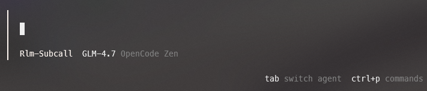

<p align="center">
    
</p>

# Tachikoma Proompt Cookbooks 🕷️

**Boot manuals and Recursive Skills for AI agents exploring your repository.**

This repository provides two distinct workflows for enhancing AI agents (Claude Code, OpenCode, etc.):

1.  **Bootstrap Templates:** One-time manuals to help an agent "learn" a specific project.
2.  **Agent Skills (RLM):** _[NEW]_ Persistent, recursive context management skills that allow agents to handle massive contexts by treating prompts as variables.

---

## 🧠 Recursive Language Models (RLM)

_Inspired by "Recursive Language Models" (Zhang et al., MIT CSAIL)._

Traditional agents suffer from "Context Rot"—as the chat gets longer, reasoning degrades.

The **Agent Skills** in this repo implement an RLM approach. Instead of stuffing the entire codebase into the context window immediately, these skills teach the agent to:

1.  **Treat Context as Variables:** Chunk prompts and files into an external environment (or variable collection).
2.  **Recursion:** Programmatically examine, decompose, and recursively call itself over snippets of the prompt.
3.  **Decomposition:** Break complex queries into sub-calls rather than attempting one massive inference.

---

## 🚀 Workflow 1: Agent Skills (Recommended)

**Best for:** Daily driving, massive codebases, preventing context rot, and "set it and forget it" configuration.

In this workflow, you install a "Skill" into your agent's configuration. This gives the agent a permanent ability to manage context recursively.

### Installation

1.  **Clone this repo**
2.  Copy `.opencode` and `AGENTS.md` to your project repo
    - Avoid putting your agent instruction files into the `.gitignore` (`AGENTS.md`, `.opencode/`, `.claude/`).
    - Keep them out of the so that the agent can pick them up from the repo root.
3.  (Optional) Tell the agent to trawl and update project-specific lore to the SKILL.md and AGENTS.md available
    - Use RLM Mode for this too
4.  Toggle RLM mode and watch the magic happen



| Platform        | Source Path in Repo | Destination Path on Local Machine                        |
| :-------------- | :------------------ | :------------------------------------------------------- |
| **Claude Code** | `.claude/skills/`   | `~/.claude/skills/` or `.claude/skills/` (project-level) |
| **OpenCode**    | `.opencode/skill/`  | `~/.config/opencode/skill/` or `.opencode/skill/`        |

---

## 📦 Workflow 2: One-Time Bootstrap (Legacy)

**Best for:** Quick exploration of a new repo without modifying agent config, or generating a static "map" of a project to share with others.

### How to Use

1.  **Pick a template** from the `.opencode/old-bootstrapper` folder (e.g., `TACHIKOMA_AGENT_BOOTSTRAP.md`).
2.  **Start a new AI session.**
3.  **Paste the template** into the chat **once**.
4.  The agent will:
    - Explore the repo.
    - Infer patterns and conventions.
    - **Generate a project-specific agent file** (e.g., `MY_PROJECT_AGENT.md`).
5.  **Save that file.**
6.  **Future Sessions:** Do not use the template. Instead, upload the generated `MY_PROJECT_AGENT.md` at the start of the chat.
    You can also save this as `AGENTS.md` in your root directory and the agent will pick it up for you.

---

## 📂 Repository Structure

```text
.
├── AGENTS.md                               # Example project-specific instructions
├── .opencode/                              # Skills formatted for OpenCode
│   └── skill/
│   └── agent/
│       └──   rlm-subcall.md
│   └── 01-let-the-agent-do-it              # The "One-Time" templates
│       └──   TACHIKOMA_AGENT_BOOTSTRAP.md
└── examples/                               # Example implementations
```

## 🛠️ Supported Platforms & Paths

This repo is designed to play nice with the **SKILL format**.

| Tool            | Primary Skill Path                      | File        |
| :-------------- | :-------------------------------------- | :---------- |
| **Claude Code** | `.claude/skills/<skill_name>/SKILL.md`  | `AGENTS.md` |
| **OpenCode**    | `.opencode/skill/<skill_name>/SKILL.md` | `AGENTS.md` |

---

### Editors / IDEs

| Tier     | Tool                                 | Notes                   |
| -------- | ------------------------------------ | ----------------------- |
| **Best** | VS Code/Cursor/Kiro + Copilot        | Just works, good stuff. |
| **Best** | Zed + Copilot                        | Shockingly good.        |
| **Okay** | Visual Studio (Enterprise) + Copilot | I mean... it works...   |

---

### Models / Agents

| Tier                         | Model             | Notes                                               |
| ---------------------------- | ----------------- | --------------------------------------------------- |
| **Best experience so far**   | Claude 4          | Consistently solid.                                 |
| **Best experience so far**   | Claude 4.5 Sonnet | Sweet spot: smart + fast.                           |
| **Best experience so far**   | Claude 4.5 Opus   | Big brain energy.                                   |
| **Mixed (experiment, YMMV)** | GPT-4 series      | Hit or miss; try different agents, some shine.      |
| **Mixed (experiment, YMMV)** | GPT-5 series      | Generally better, still inconsistent; worth poking. |
| **Not recommended, for now** | Grok models       | No ❤️.                                              |
| **Promising**                | Gemini 3+         | Good vibes, needs tuning.                           |

---

### Tools to Watch 👀

| Tier            | Tool     | Notes                          |
| --------------- | -------- | ------------------------------ |
| **Horii Shiet** | Opencode | I'm actively using it more now |
| **Promising**   | RooCode  | Pretty good                    |

---

### Notes

Copilot is doing a lot of the heavy lifting here —
work pays for it, so I'm turning the knobs and trying **every model it'll let me** 😄

---

### Disclaimer

AI agents vary wildly by model, tool, and prompt plumbing.
**Your mileage may vary.**
Experiment and trust local results over lists like this.

---

## Credits

- **RLM Concept:** Based on _Recursive Language Models_ (2025) by Zhang, Kraska, and Khattab (MIT CSAIL).
- **Tachikoma:** Named after the curious, chatty, and adaptive AI tanks from _Ghost in the Shell_.
- **claude_code_RLM:** Yoinked the RLM scripts and proompts from [brainqub3/Claude Code RLM](https://github.com/brainqub3/claude_code_RLM)
