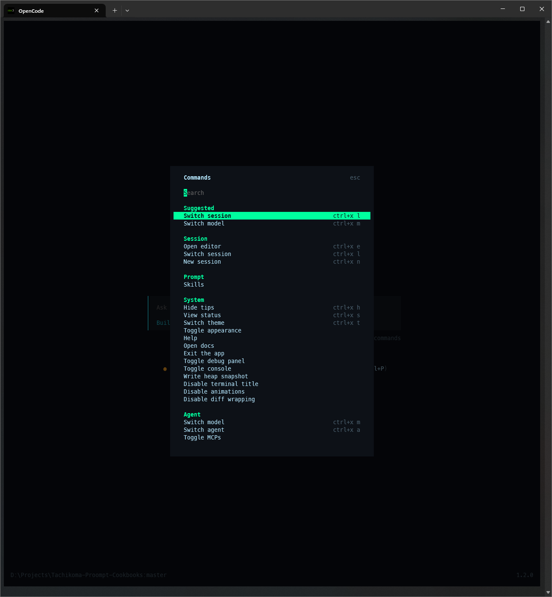
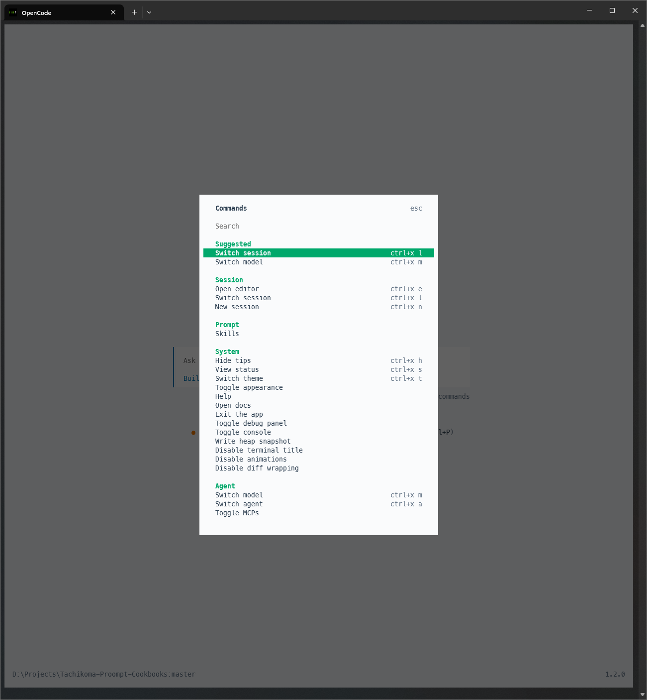
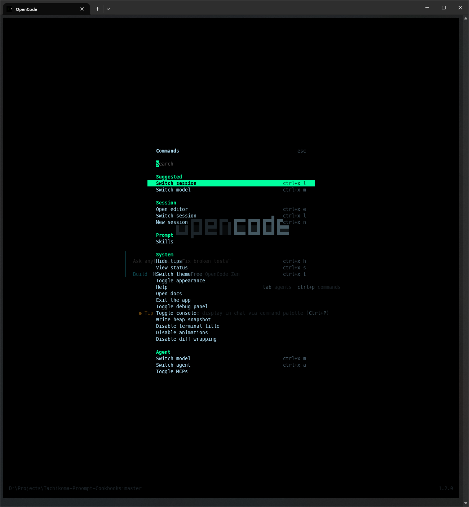
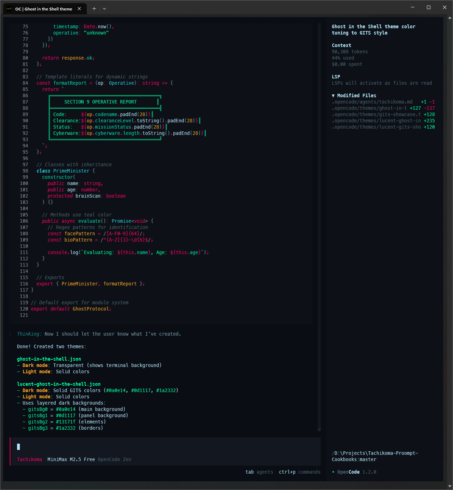
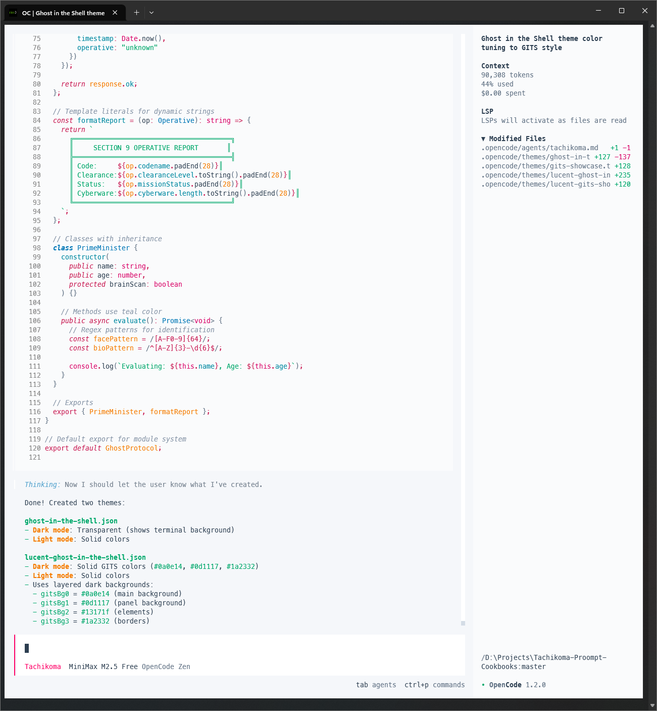
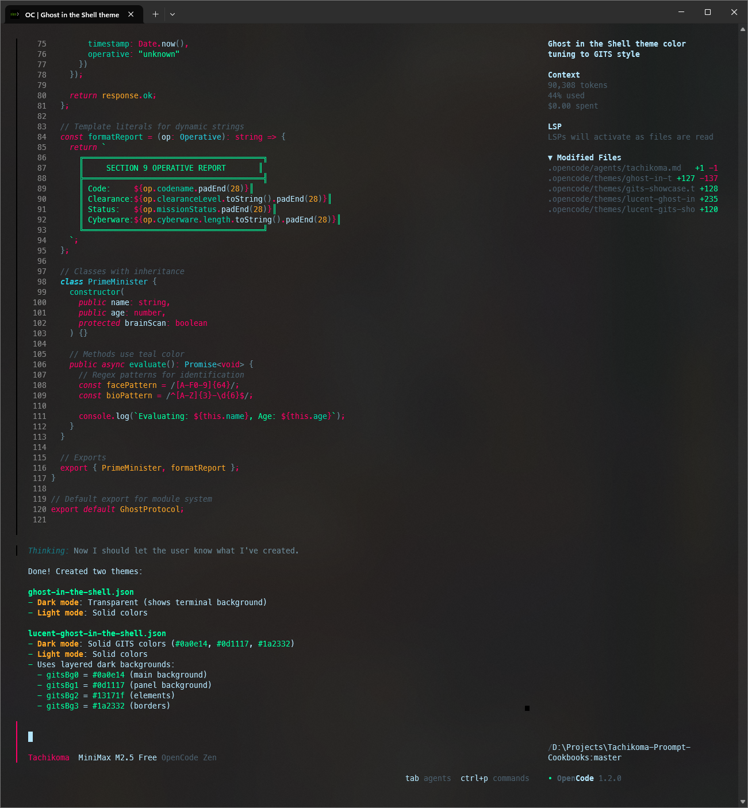

<p align="center">
    
</p>

# Tachikoma 🕷️

**Agent coordination system for AI-assisted development.**

A modular framework that helps AI agents understand your project, follow your conventions, and route tasks to the right specialist.

Named after the curious, chatty AI tanks from _Ghost in the Shell_ — always learning, always asking questions.

---

## Core Concepts

- **Orchestrator Pattern** — Primary agent coordinates all activity
- **Intent-Based Routing** — Classifies requests, routes to appropriate skills/subagents
- **Context Modules** — Project-specific rules load based on task type
- **Self-Learning** — Tracks patterns, suggests improvements

---

## How It Works

Tachikoma handles every request, classifies the intent, loads relevant context, and routes to the appropriate skill or subagent.

For detailed architecture, see [docs/concepts/overview.md](docs/concepts/overview.md).

---

## 🎨 Themes

Ghost in the Shell inspired themes for OpenCode terminal:

| Theme                     | View       | Dark                                                      | Light                                               |
| ------------------------- | ---------- | --------------------------------------------------------- | --------------------------------------------------- |
| ghost-in-the-shell        | Start Page |       |      |
| lucent-ghost-in-the-shell | Start Page |      |      |
| ghost-in-the-shell        | Menu       |   |  |
| lucent-ghost-in-the-shell | Menu       |  |  |
| ghost-in-the-shell        | Chat       |   |  |
| lucent-ghost-in-the-shell | Chat       |  |  |

> Light mode uses solid colors — transparency doesn't work well in light mode.

---

## Quick Install

```bash
curl -sS https://raw.githubusercontent.com/Nirvaxstiel/Tachikoma-Proompt-Cookbooks/master/.opencode/tachikoma-install.sh | bash
```

Or copy `AGENTS.md` and `.opencode/` to your repo root.

Full guide: [docs/getting-started.md](docs/getting-started.md)

---

## Documentation

| Guide         | Where                                                                                      |
| ------------- | ------------------------------------------------------------------------------------------ |
| Full docs     | [docs/](docs/)                                                                             |
| Skills        | [.opencode/skills/\*/SKILL.md](.opencode/skills/)                                          |
| Customization | [docs/capabilities/customization/overview.md](docs/capabilities/customization/overview.md) |

---

## 🤖 Tested Models

| Model               | Notes                                                                       |
| ------------------- | --------------------------------------------------------------------------- |
| Claude 4.6 Opus     | Big brain energy                                                            |
| Kimi K2.5           | Strong alternative to Sonnet                                                |
| GLM 5               | Seems to be great value. Waiting for it to roll out to me for field testing |
| Minimax M2.5        | Shockingly good                                                             |
| Claude 4.5 Sonnet   | Current sweet spot                                                          |
| GLM 4.7             | Almost as good as Sonnet                                                    |
| Gemini 3 Deep Think | ARC-AGI-2: 84.6%, Codeforces 3455Elo                                        |
| o1/o3 Pro           | Excellent for complex reasoning                                             |
| GPT-5.3 series      | Much better than previous                                                   |

> **Copilot** is doing a lot of the heavy lifting — I'm turning the knobs and trying **every model it'll let me** 😄

---

## Research & Credits

Built on peer-reviewed LLM research:

| Paper                                  | Basis                           |
| -------------------------------------- | ------------------------------- |
| Tool-Augmented LLMs (arXiv:2601.02663) | Cost-aware routing              |
| Agentic Proposing (arXiv:2602.03279)   | Skill composition               |
| ARC-AGI Benchmark                      | Intelligence efficiency metrics |
| MIT RLM                                | Adaptive chunking               |

RLM concept based on [brainqub3/Claude Code RLM](https://github.com/brainqub3/claude_code_RLM).

---

## License

MIT — Do whatever. Fork it, hack it, use it in closed-source.
